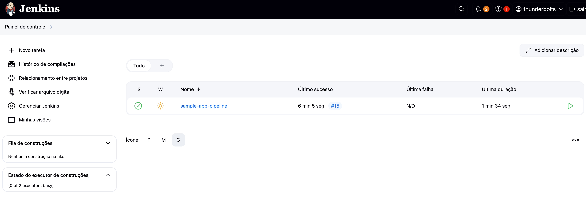

# Pipeline CI/CD com Jenkins, ECR e ECS 🚀

Este projeto implementa um pipeline completo de CI/CD usando Jenkins para uma aplicação Python Flask, com deploy automatizado na AWS utilizando Docker, ECR (Elastic Container Registry) e ECS (Elastic Container Service).

## 📋 Índice

- [Arquitetura](#arquitetura)
- [Pré-requisitos](#pré-requisitos)
- [Estrutura do Projeto](#estrutura-do-projeto)
- [Configuração da Infraestrutura](#configuração-da-infraestrutura)
- [Configuração do Jenkins](#configuração-do-jenkins)
- [Pipeline CI/CD](#pipeline-cicd)
- [Deploy da Aplicação](#deploy-da-aplicação)
- [Monitoramento](#monitoramento)
- [Troubleshooting](#troubleshooting)
- [Capturas de Tela](#capturas-de-tela)

## 🏗️ Arquitetura

```
┌─────────────┐     ┌─────────────┐     ┌─────────────┐     ┌─────────────┐
│   GitHub    │────▶│   Jenkins   │────▶│     ECR     │────▶│  ECS/Fargate│
└─────────────┘     └─────────────┘     └─────────────┘     └─────────────┘
                           │                                        │
                           ▼                                        ▼
                    ┌─────────────┐                          ┌─────────────┐
                    │   Docker    │                          │     ALB     │
                    └─────────────┘                          └─────────────┘
                                                                    │
                                                                    ▼
                                                             ┌─────────────┐
                                                             │  Internet   │
                                                             └─────────────┘
```

### Componentes:

- **GitHub**: Repositório de código fonte
- **Jenkins**: Servidor de CI/CD
- **Docker**: Containerização da aplicação
- **ECR**: Registro de imagens Docker na AWS
- **ECS/Fargate**: Orquestração de containers
- **ALB**: Load Balancer para distribuição de tráfego

## 🔧 Pré-requisitos

### Ferramentas Necessárias:

- AWS CLI configurado
- Terraform >= 1.0
- Git
- Docker
- Conta AWS com permissões adequadas

### Conhecimentos Requeridos:

- Conceitos básicos de CI/CD
- Docker e containerização
- AWS Services (EC2, ECS, ECR, VPC)
- Terraform para IaC

## 📁 Estrutura do Projeto

```
jenkins-cicd-aws/
├── terraform/                    # Infraestrutura como Código
│   ├── main.tf                  # Configuração principal
│   ├── variables.tf             # Variáveis
│   ├── outputs.tf               # Outputs
│   ├── modules/                 # Módulos Terraform
│   │   ├── vpc/                 # Configuração de rede
│   │   ├── security/            # Security Groups
│   │   ├── compute/             # Instâncias EC2
│   │   ├── ecr/                 # Container Registry
│   │   ├── ecs/                 # Container Service
│   │   └── elastic-ip/          # IPs elásticos
│   └── user-data.sh             # Script de inicialização
├── sample-app/                  # Aplicação de exemplo
│   ├── app.py                   # Aplicação Flask
│   ├── requirements.txt         # Dependências Python
│   ├── Dockerfile               # Imagem Docker
│   ├── test_app.py              # Testes unitários
│   └── Jenkinsfile              # Pipeline CI/CD
├── scripts/                     # Scripts auxiliares
│   ├── setup-backend.sh         # Configurar backend Terraform
│   └── configure-jenkins.sh     # Configurar Jenkins
└── README.md                    # Este arquivo
```

## 🚀 Configuração da Infraestrutura

### 1. Preparar Backend do Terraform

```bash
# Configurar S3 e DynamoDB para estado remoto
./scripts/setup-backend.sh
```

### 2. Criar Chave SSH

```bash
# Criar par de chaves na AWS
aws ec2 create-key-pair --key-name jenkins-key-dev \
    --query 'KeyMaterial' --output text > ~/.ssh/jenkins-key-dev.pem
chmod 400 ~/.ssh/jenkins-key-dev.pem
```

### 3. Deploy da Infraestrutura

```bash
cd terraform/
terraform init
terraform plan -var="key_name=jenkins-key-dev"
terraform apply -var="key_name=jenkins-key-dev" -auto-approve
```

### 4. Recursos Criados

- VPC com subnets públicas e privadas
- Security Groups configurados
- Instância EC2 com Jenkins
- ECR Repository
- ECS Cluster com Fargate
- Application Load Balancer
- Roles IAM necessários

## ⚙️ Configuração do Jenkins

### 1. Acessar Jenkins

```bash
# Obter URL do Jenkins
JENKINS_URL=$(terraform output -raw jenkins_url)
echo $JENKINS_URL

# Obter senha inicial
ssh -i ~/.ssh/jenkins-key-dev.pem ubuntu@<IP> \
    "sudo cat /var/lib/jenkins/secrets/initialAdminPassword"
```

### 2. Configuração Inicial

1. Acessar URL do Jenkins no navegador
2. Inserir senha inicial
3. Instalar plugins sugeridos
4. Criar usuário administrador

### 3. Plugins Necessários

- Docker Pipeline
- Amazon ECR
- Pipeline: AWS Steps
- GitHub Integration
- Blue Ocean (opcional)

### 4. Configurar Credenciais

#### GitHub Token:
1. GitHub → Settings → Developer settings → Personal access tokens
2. Gerar novo token com permissões: `repo`, `workflow`
3. No Jenkins: Manage Jenkins → Credentials → Add Credentials
   - Kind: Username with password
   - ID: `github-credentials`
   - Username: seu-usuario-github
   - Password: token-gerado

#### AWS Credentials:
1. No Jenkins: Manage Jenkins → Credentials → Add Credentials
   - Kind: AWS Credentials
   - ID: `aws-credentials`
   - Access Key ID: sua-access-key
   - Secret Access Key: sua-secret-key

## 📦 Pipeline CI/CD

### 1. Estrutura do Pipeline

```groovy
pipeline {
    agent any
    
    environment {
        AWS_REGION = 'us-east-1'
        ECR_REPOSITORY = "${AWS_ACCOUNT_ID}.dkr.ecr.${AWS_REGION}.amazonaws.com/app"
        ECS_CLUSTER = 'jenkins-cicd-dev'
        ECS_SERVICE = 'jenkins-cicd-dev'
    }
    
    stages {
        stage('Checkout')
        stage('Test')
        stage('Build')
        stage('Push to ECR')
        stage('Deploy to ECS')
    }
}
```

### 2. Criar Pipeline Job

1. Jenkins → New Item → Pipeline
2. Nome: `sample-app-pipeline`
3. Pipeline from SCM:
   - SCM: Git
   - Repository URL: https://github.com/seu-usuario/seu-repo
   - Credentials: github-credentials
   - Branch: */main
   - Script Path: sample-app/Jenkinsfile

### 3. Executar Pipeline

1. Build Now
2. Acompanhar execução no Blue Ocean ou Stage View
3. Verificar logs de cada stage

## 🚢 Deploy da Aplicação

### 1. Build e Push para ECR

```bash
# Login no ECR
aws ecr get-login-password --region us-east-1 | \
    docker login --username AWS --password-stdin <ECR_URI>

# Build da imagem
docker build -t sample-app:latest ./sample-app

# Tag e push
docker tag sample-app:latest <ECR_URI>:latest
docker push <ECR_URI>:latest
```

### 2. Deploy no ECS

```bash
# Atualizar service
aws ecs update-service \
    --cluster jenkins-cicd-dev \
    --service jenkins-cicd-dev \
    --force-new-deployment

# Verificar status
aws ecs describe-services \
    --cluster jenkins-cicd-dev \
    --services jenkins-cicd-dev
```

### 3. Verificar Aplicação

```bash
# Obter URL do ALB
ALB_URL=$(terraform output -raw alb_dns_name)
curl http://$ALB_URL/health
```

## 📊 Monitoramento

### CloudWatch Logs

```bash
# Ver logs do ECS
aws logs tail /ecs/jenkins-cicd-dev --follow
```

### CloudWatch Metrics

- CPU e Memória do ECS
- Latência do ALB
- Healthy hosts no Target Group

### Health Checks

- Jenkins: http://<JENKINS_IP>:8080
- Aplicação: http://<ALB_DNS>/health

## 🔍 Troubleshooting

### Jenkins não está acessível

```bash
# Verificar status
sudo systemctl status jenkins

# Ver logs
sudo journalctl -u jenkins -f

# Verificar Security Group
aws ec2 describe-security-groups --filters "Name=group-name,Values=*jenkins*"
```

### Pipeline falhando

1. Verificar credenciais do GitHub
2. Verificar permissões IAM
3. Verificar se Docker está rodando
4. Revisar logs do Jenkins

### ECS não inicia tasks

```bash
# Ver eventos do service
aws ecs describe-services \
    --cluster jenkins-cicd-dev \
    --services jenkins-cicd-dev \
    --query 'services[0].events[:5]'

# Verificar logs do container
aws logs get-log-events \
    --log-group-name /ecs/jenkins-cicd-dev \
    --log-stream-name <STREAM_NAME>
```

### Aplicação não responde

1. Verificar Target Group health
2. Verificar Security Groups do ALB e ECS
3. Verificar logs da aplicação
4. Testar conectividade entre componentes

## 📸 Capturas de Tela

### 1. Terraform Apply


### 2. Jenkins Dashboard


### 3. Pipeline em Execução


### 4. ECS Service


### 5. Aplicação Rodando


## 🔐 Segurança

### Boas Práticas Implementadas:

- Secrets não expostos no código
- IAM roles com princípio do menor privilégio
- Security Groups restritivos
- Imagens Docker escaneadas no ECR
- HTTPS habilitado no ALB (produção)

### Melhorias Recomendadas:

- Implementar VPN para acesso ao Jenkins
- Usar AWS Secrets Manager para senhas
- Habilitar MFA para usuários Jenkins
- Implementar network policies no ECS

## 🤝 Contribuindo

1. Fork o projeto
2. Crie uma branch para sua feature (`git checkout -b feature/AmazingFeature`)
3. Commit suas mudanças (`git commit -m 'Add some AmazingFeature'`)
4. Push para a branch (`git push origin feature/AmazingFeature`)
5. Abra um Pull Request

## 📝 Licença

Este projeto está sob a licença MIT. Veja o arquivo `LICENSE` para mais detalhes.

## 👥 Autores

- **Seu Nome** - *Trabalho Inicial* - [ndevops25](https://github.com/ndevops25)

## 🙏 Agradecimentos

- Professor pela orientação
- Colegas de turma pelo apoio
- Documentação da AWS e Jenkins

---

**Nota**: Este projeto foi desenvolvido como parte do trabalho CP2 - Construção de um Pipeline CI/CD usando Jenkins.